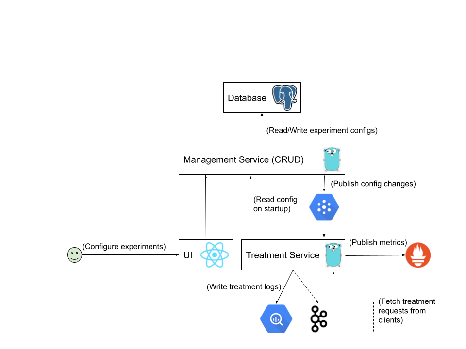

# xp

[](https://github.com/caraml-dev/xp/blob/master/LICENSE)

## Overview

XP helps with designing and managing experiment configurations in a safe and holistic manner. At runtime, these configurations can be used to run experiments and generate treatments.

The API is broken down into 2 services:

- **Management Service**: Used to configure experiments
- **Treatment Service**: Used to obtain the treatment configuration from active experiments

### Architecture

The following diagram summarizes the interaction between the various components of the system. The Management service is packaged together with the UI, while the Treatment service is published separately - this is so that the Treatment service, which is lightweight, can be deployed and made to scale independently.



## Why XP?

- **Reliable** - Inherent fault-detection rules help create experiments without conflicts.
- **Customizable** - Every service has unique requirements. XP allows for defining flexible segmentation and experiment validation rules.
- **Fast** - 99p server-side latency (excluding the network latency between the calling service and XP) averages around 1 ms.
- **Observable** - Resource utilization, treatment assignment and performance metrics are available on Prometheus

## Development Environment

### Quick Start

#### a. Setup MLP API

Instructions as described in README of https://github.com/gojek/mlp.

#### b. Starting XP

Prior to starting XP, we'll need to ensure correct MLP API is correctly set in the config file, i.e management-service/config/example.yaml, and setting the correct `MLPConfig::URL` value.

```bash
# Start Management Service
make mgmt-svc

# Start Treatment Service
make treatment-svc

# Exploring Swagger-UI
make swagger-ui
```

`make mgmt-svc` runs the following:

1. `make local-db`
    - Setup a local DB for storing experiment configurations
2. `make local-authz-server`
    - Setup AuthZ server that is accessible at http://localhost:4466/.

To test authorization for Management Service locally, make the following changes before starting Management Service:

- A sample policy exists at keto/policies/example_policy.json. It can be modified.
- Set AuthorizationConfig.Enabled=true in the config file that's being used
- Issue requests to the app with the header User-Email: test-user@gojek.com

#### c. Using XP

To use the XP Go modules as API dependencies, simply import the XP Go modules directly i.e. `import "github.com/caraml-dev/xp/..."`

## Contributing

XP is still under active development. Please have a look at our contributing and development guides if you want to contribute to the project:

- [Contribution Process for XP](https://github.com/caraml-dev/xp/blob/main/CONTRIBUTING.md)
