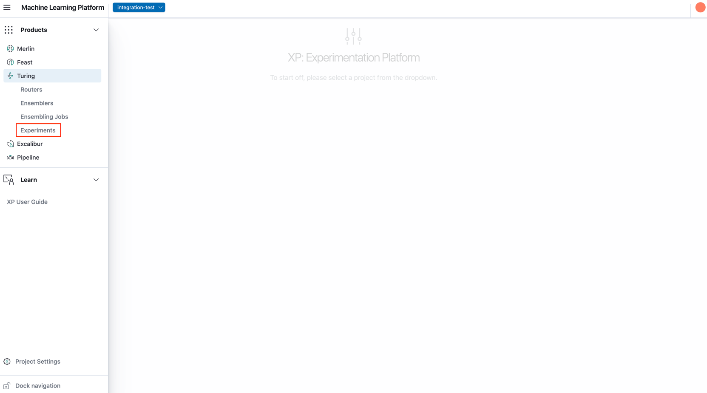
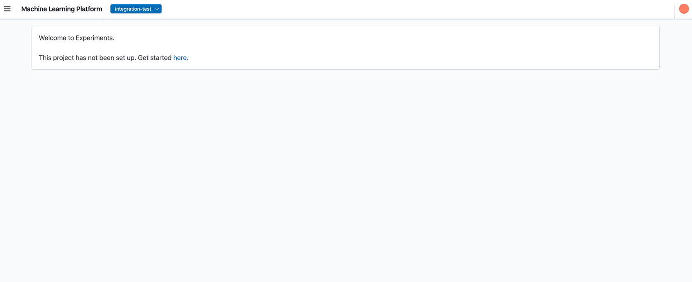
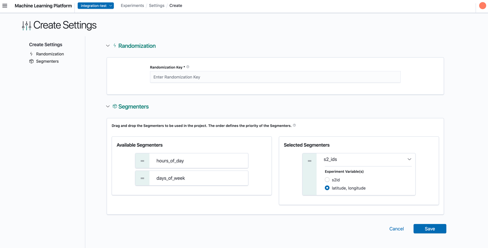

# Getting Started with Experiments

## Onboarding Process

For access to XP, users can self-onboard via the MLP UI.

1. Visit MLP Landing Page, open the sidebar and click `Experiments`.

2. You should see the following Landing page, if you have yet to setup the project for Experiments.

3. Upon clicking 'here' in the previous page, you should see a form to input the necessary settings.

4. Enter a name for the Randomization Key and select the Segmenters.
    - The order of the segmenters determines the priority of the segmenters when optional segmenters are used. For example, if the chosen segmenters are `s2_ids`, and `days_of_week` (in that order) and a given request matches 2 experiments - one where the `s2_ids` is optional and another one where the `days_of_week` is optional, the s2_ids experiment (where there is an exact match of the s2_ids) will be chosen. For more information and examples, please refer to the [Experiment Hierarchy](../concepts.md#Experiment-Hierarchy) section in the Introduction page.

    - Where the segmenter may be computed from several different (groups of) variables at runtime, also select the desired variable mapping. For example, `s2_ids` may be supplied as `s2_id` or computed from `latitude,longitude`. This must be specified in the settings.

5. Click on Save. And voila! The onboarding is complete and you should see the configured settings.
The project credentials (in particular, the `passkey`) would be required for running experiments
([Turing](https://github.com/caraml-dev/turing/tree/main/docs) takes care of this if you are running the experiments through its routers).

