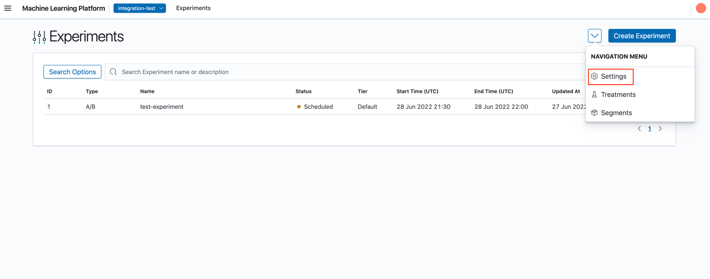
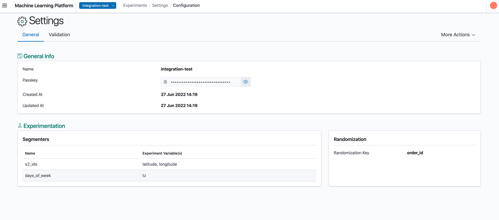
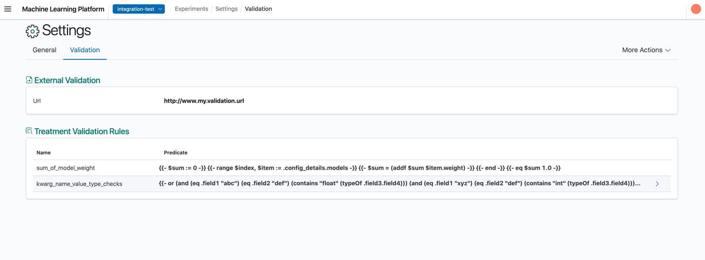

# Viewing Settings

From the Experiments List page, clicking the 'arrow' and 'Settings' icon would bring you to the Settings Details page.



## General Configuration



1. General Info: General settings of the project.
2. Experimentation: Segmenters and experiment variables of the project.
3. Randomization: Randomization key of the project.

## Validation Configuration



1. External Validation: URL of external validation to validate experiments.
2. Treatment Validation Rules: Rules used to validate treatment configuration of experiments.

### Treatment Validation Rules

Treatment Validation Rules allows users to specify rules that the treatment configuration of experiments must comply. XP uses [Go Template](https://pkg.go.dev/text/template) and the [Sprig library](http://masterminds.github.io/sprig/) as the template function. The treatment configuration will be templated with the predicate provided and the final output must return `true` for the operation to be permitted.

This is useful to prevent careless mistakes while creating the treatment configuration, such as creating rules to ensure the weight of the models sums to 1 or to ensure that a control is set for every treatment.

#### Sample rules

* Checking if a field matches some string and float type provided

```text
{{- or (and
         (eq .field1 "abc")
         (eq .field2 "def")
         (contains "float" (typeOf .field3.field4)))
     (and
         (eq .field1 "xyz")
         (eq .field2 "def")
         (contains "int" (typeOf .field3.field4))) -}}
```

* Checking sum of weights of models is 1

```text
{{- $sum := 0 -}}
 {{- range $index, $item := .config_details.models -}}
   {{- $sum = (addf $sum $item.weight) -}}
 {{- end -}}
{{- eq $sum 1.0 -}}
```
