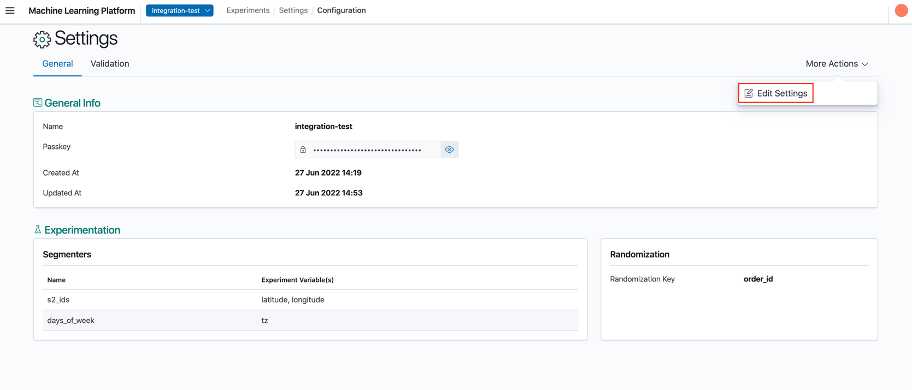
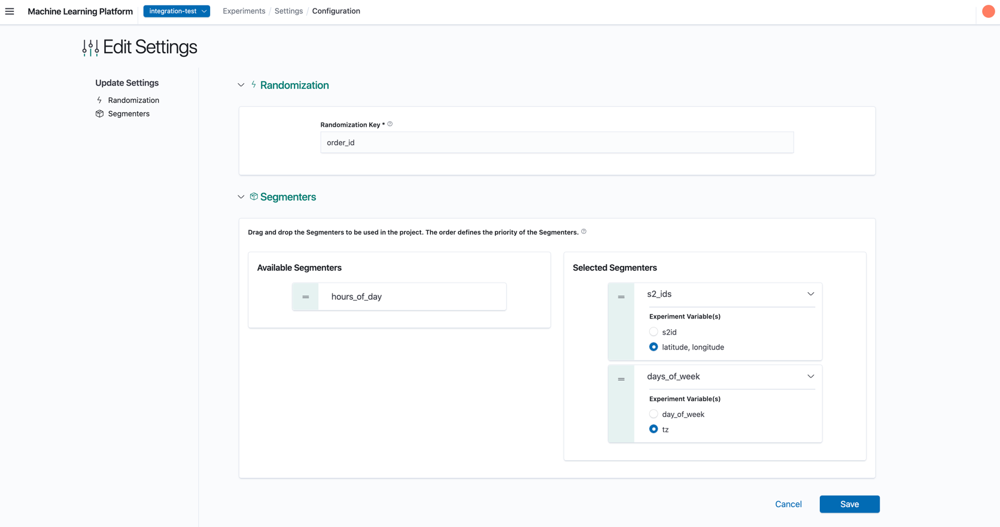
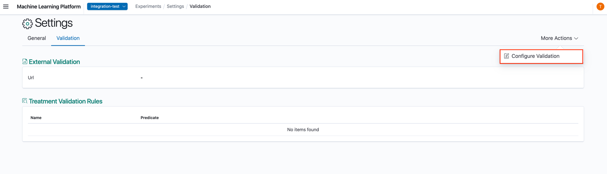
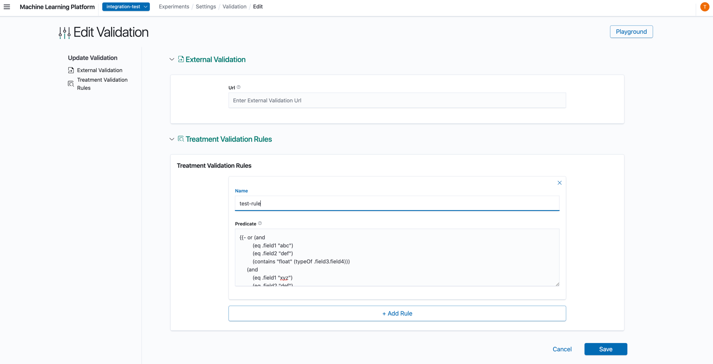
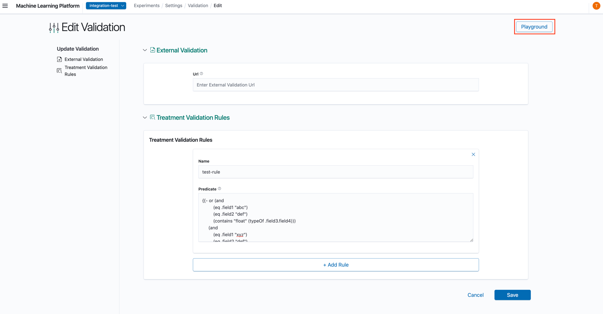
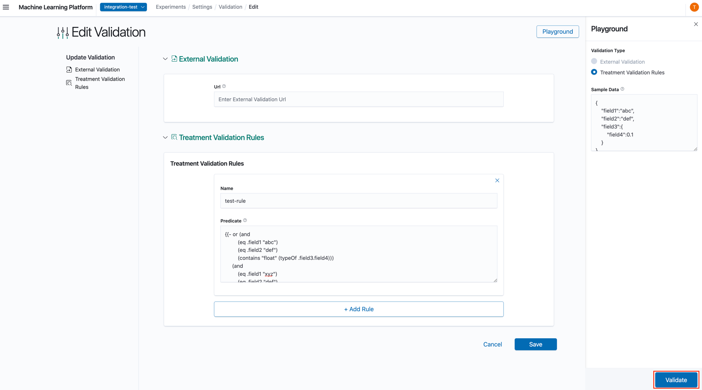

# Modifying Settings

In the Settings Details Page, click 'More Actions' -> 'Edit Settings'



In the Edit Experiment Page, you can edit the `randomization_key`, the list of `segmenters` and their variable mappings.



When modifying settings, please take note of the following pointers:

1. Segmenters with asterisk(*) are required segmenters that cannot be removed from the selected list.
2. Removing Segmenters will not be allowed when there are 1 or more 'active' and 'yet-to-end' experiments that are not defined granularly enough.

    The following scenario is an example:
    * Currently selected segmenters: `country`, `service`
    * Currently created experiments:

    ```text
        // Experiment 1
        {
            "name": "test-exp-1",
            "created_at": "2022-06-27T10:00:00.0000Z",
            "segment": {
                "country": ["SG"],
                "service": [1]
            },
            ...
        }

        // Experiment 2
        {
            "name": "test-exp-2",
            "created_at": "2022-06-27T10:00:00.0000Z",
            "segment": {
                "country": ["SG"],
                "service": [2]
            },
            ...
        }
    ```

    Suppose we want to remove `service` segmenter from the project, this would make it impossible to distinguish between both experiments when XP tries to fetch a treatment because the only segmenter is `country` and both experiments have the same value, i.e, `SG` in this case.

## Edit Validation

Validation configuration can be edited and configuration can be tested in the playground provided in the Edit Validation View.
Both External Validation URL and Treatment Validation Rules can be left blank.

From the Validation Detail page, click 'More Actions' -> 'Configure Validation'.



### Edit Validation Page

1. In the Edit Validation Page, you can edit the Validation's configuration.

2. External Validation: URL of external validation to validate experiments.

   * Note that the external validation endpoint will be called whenever experiments or treatments are created or edited. XP will send a POST request to the following HTTP endpoint with the following payload that has to be handled by the custom web service:

   ```text
   POST /validate-experiment
   {
       "entity_type": // oneOf {experiment, treatment}
       "operation": // oneOf {create, update}
       "data": {
   
       } // The json object representing the new experiment or treatment being created or saved
       "context": {
           "current_data": {} // Current entity, in update operations
       } // Optional context information
   }
   ```

   * A response with status code of 200 will be deemed as successful. A timeout of 5 seconds is also configured to treat any hanging call to the validation URL as a failure.

3. Treatment Validation Rules: Rules used to validate treatment configuration of experiments. All rules will be evaluated on the treatment configuration and must return `true` for the operation to be permitted.

### Creating or Updating an Experiment

Sample experiment schema:

```json
{
    "id":0,
    "project_id":1,
    "name":"test-experiment-create",
    "description":"Test description",
    "type":"Switchback",
    "interval":60,
    "tier":"default",
    "treatments":[
        {
            "configuration":{
                "meta":{
                    "created-by":"test"
                },
                "weight":0.2
            }, 
            "name":"treatment",
            "traffic":100
        }
    ],
    "segment":{
        "country":[
            "ID",
            "SG"
        ]
    }
}
```

* The entire experiment will be sent to the validation url for validation
* *Each* treatment configuration within the experiment will be validated with *all* of the treatment validation rules

Both of these conditions must be fulfilled before the experiment can be created or updated successfully.

### Creating or Updating a Treatment

Sample treatment schema:

```json
{
    "field1":"abc", 
    "field2":"def", 
    "field3":{
        "field4":0.1
    }
}
```

* The treatment configuration will be sent to the validation url for validation
* The treatment configuration will be validated with *all* of the treatment validation rules

Both of these conditions must be fulfilled before the treatment can be created or updated successfully.

## Validation Playground

To test entities such as treatment configuration, before saving them, you can access the validation playground page by
clicking the blue button `Playground` at the top right hand corner of the `Edit Validation Page`.



1. External Validation: Select the `External Validation` radio button under `Validation Type` and fill in the `Sample Data` text field with a sample **payload** that you would like to send your validation url.
2. Treatment Validation Rules: Select the `Treatment Validation Rules` radio button under `Validation Type` and fill in the `Sample Data` text field with a **treatment configuration** that you would like to validate against the treatment validation rules.

Click on validate once you are done to perform the validation.


