# Viewing Experiments

Once the experiment has been created, you will be able to view the experiment's configuration on the landing page.

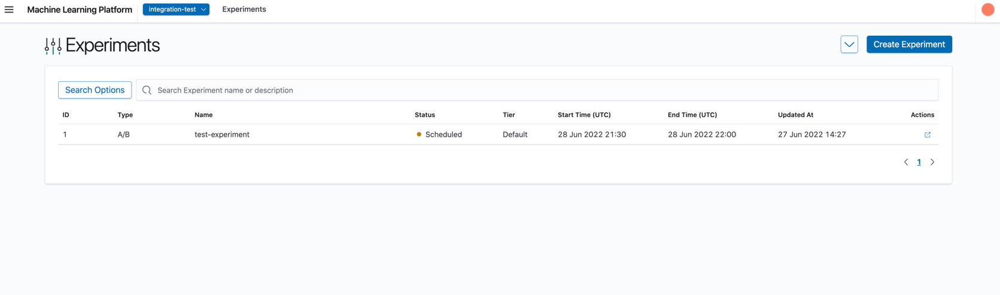

## Navigate to Experiment Details

1. Click on the row that contains the experiment.
2. You will now be able to see the Experiment Details View.
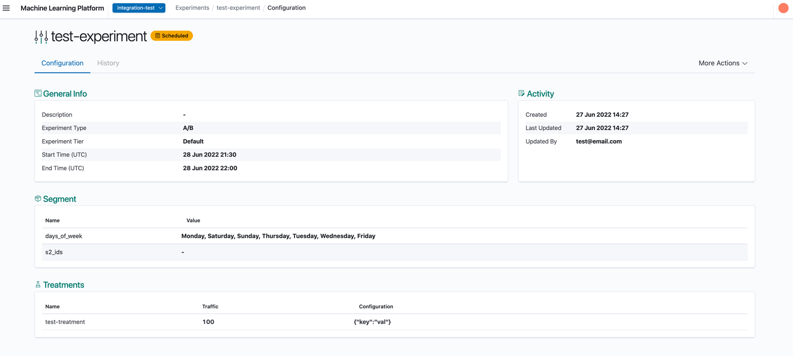
At the top row, you will be able to see your experiment name and a badge that indicates the status of experiment

| Status       | Description                                          | Badge                                                                                   |
| ------------ | ---------------------------------------------------- | --------------------------------------------------------------------------------------- |
| Running      | Experiment is active and currently running           | 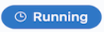      |
| Scheduled    | Experiment is active and start time is in the future | 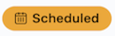  |
| Completed    | Experiment is active and end time is the past       | 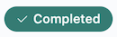  |
| Deactivated  | Experiment is inactive                               | 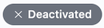 |

### Configuration

The Configuration tab displays the selected experiment's details. These values are configured from creating or editing an experiment.

1. General Info: General settings of the experiment.
2. Activity: Activity details of experiment.
3. Segment: Segmenters of experiment.
4. Treatments: Treatments Configurations for 1 or more registered Treatment(s).

### Searching

The UI supports two types of search - Basic and Advanced. Advanced search options enable filtering the experiments by different attributes.

## Basic Search

1. In the search panel, enter the experiment name or description to filter by.
   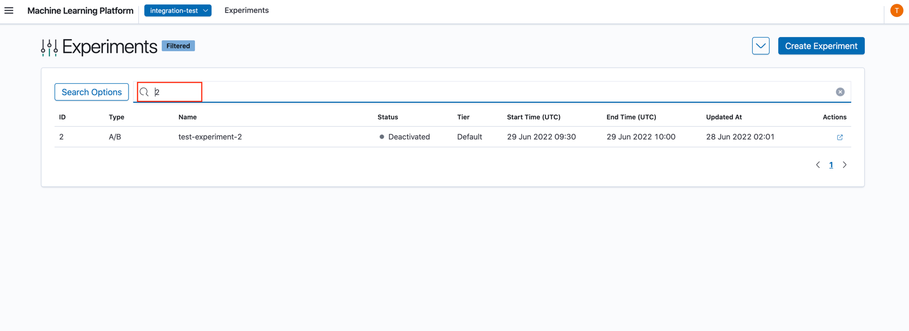

## Advanced Search

1. Click "Search Options", this will open up the Filters Panel.
   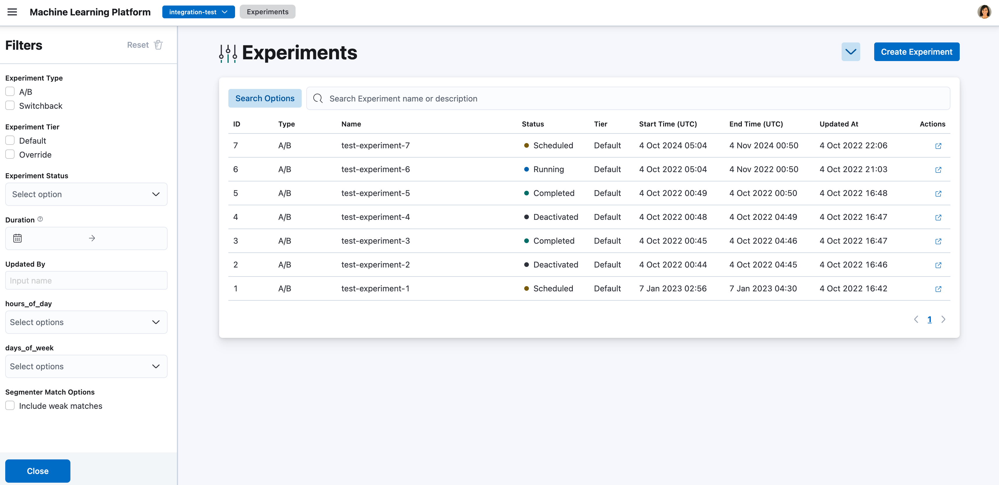

2. In the Filters Panel, select the respective filters to apply. A "Filtered" badge will be shown beside experiment name to indicate that the experiments are filtered.
   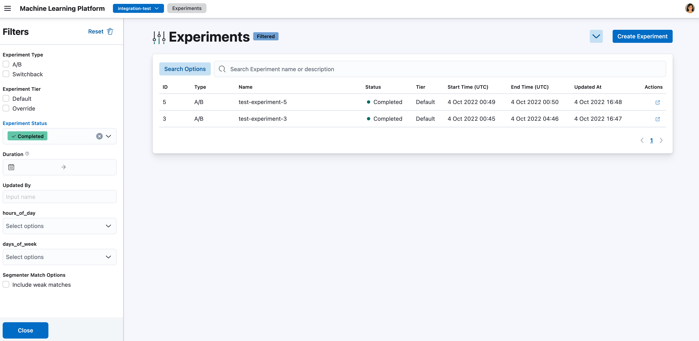

### History

When an experiment is modified (edited / activated / deactivated) its existing configurations are saved as a historical version. All versions can be viewed from the **History** tab of the Experiment Detail view.

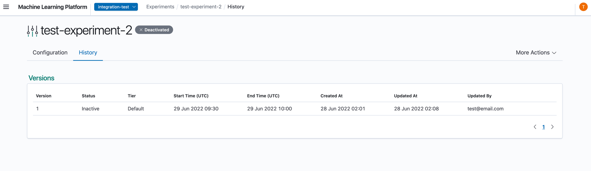

The versions are ordered in the descending order of creation (the most recent version appearing on top). The Created and Updated dates of the version symbolize the duration that the configuration was applied in the experiment. Selecting a row opens the details of the version.

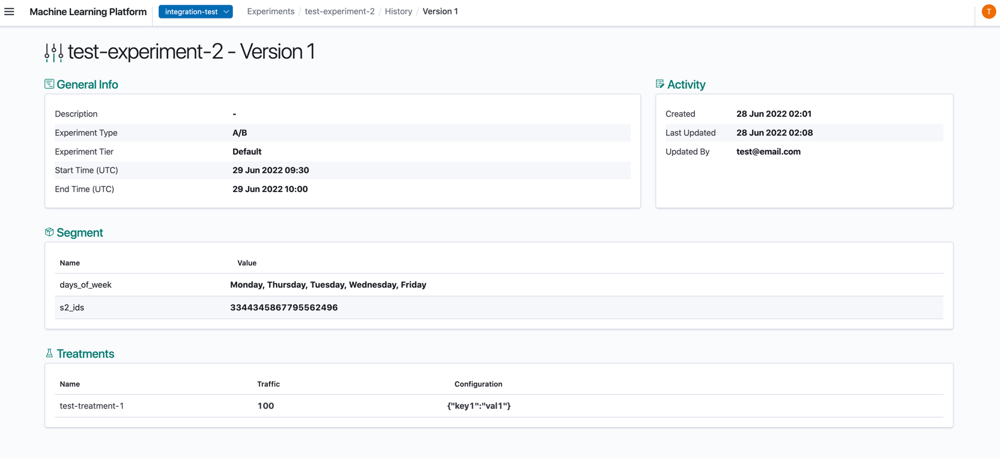
