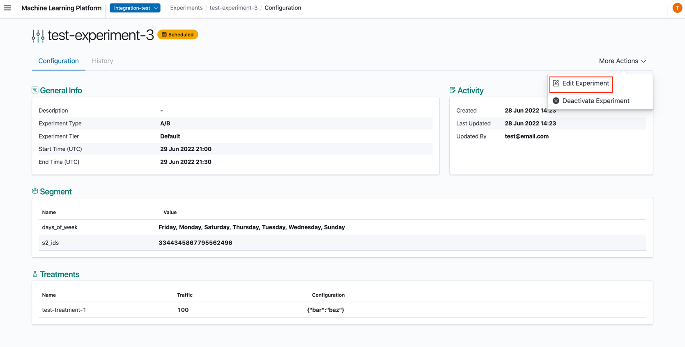
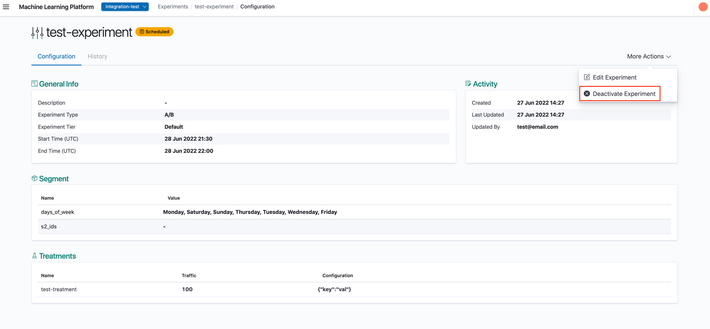
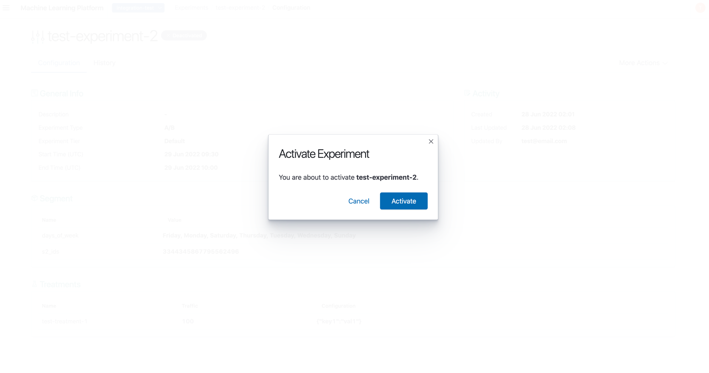
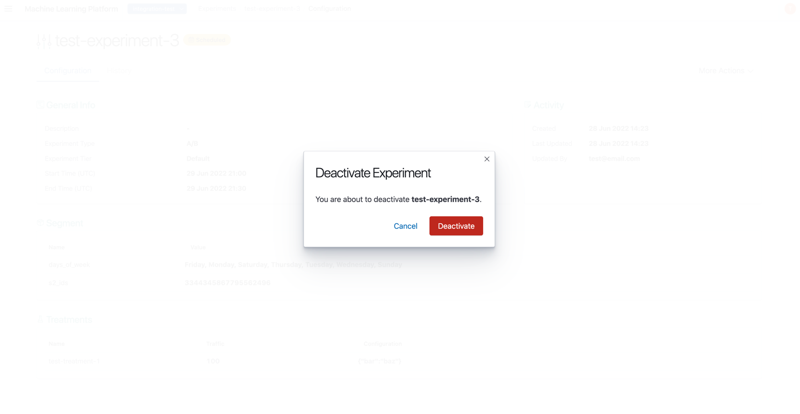

# Modifying Experiments

In the Experiment Details Page, click 'Edit Experiment'.

In the Edit Experiment Page, you can edit the experiment's configuration. All fields except **Name** and **Experiment Type** are allowed to be modified.

## Enabling / Disabling Experiments

This impacts the `status` field in the experiment. Experiments are only considered to be running when the following conditions are met:

* Current time falls within the experiment start and end times
* Experiment status is 'active'

Experiments can be created in the 'active' state and disabled later on, or vice versa, which can help instantly modify its behavior.

1. In the Experiment Details Page, you can click 'Activate Experiment' or 'Deactivate Experiment' button beside the 'Edit Experiment' button to change the status. Corresponding button will be shown based on the status.

2. Upon clicking the button, a confirmation window will be shown.

## Experiment History

When an experiment is edited or its status is changed, the existing details in the experiment prior to the edit would be saved as a historical version and can be viewed from the **History** tab in the Experiment Details view.

## Deleting Experiments

Experiments in XP cannot be deleted - users can simply disable experiments to prevent them from being run.
