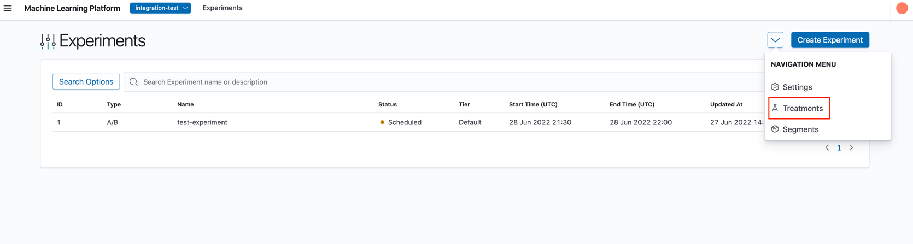
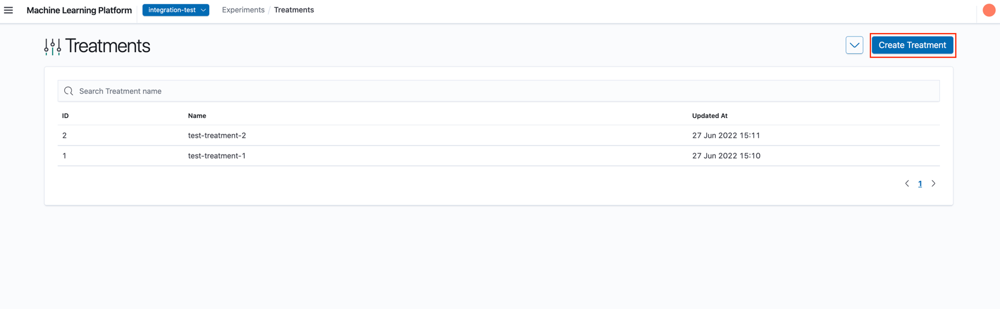
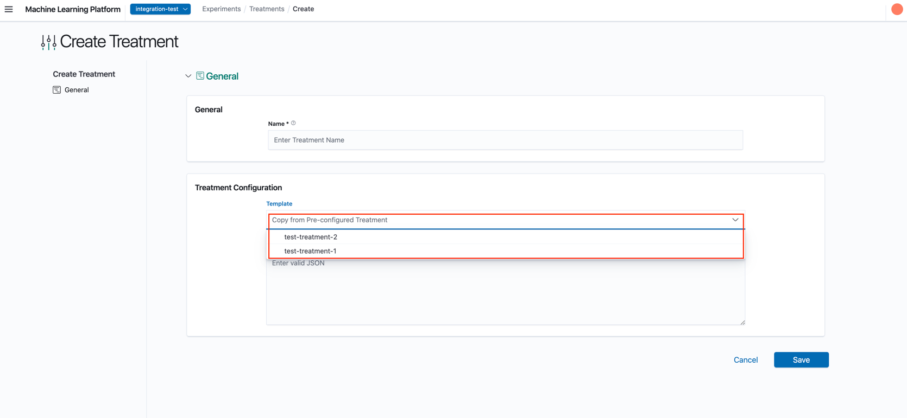

# Creating Treatments

From the Experiments List page, click on 'Treatments'.

Treatments can be created from the treatments landing page. Created treatments can be used as a template, to initialise one or more treatments in an experiment (See `Creating Experiments - Configure Experiment's Treatments` for more information).

## 0. Create Treatment

a. Click on the "Create Treatment" button on the landing page.

## 1. Configure Treatment's General Settings

a. In the Create Treatment's general settings page, you may either input the fields from scratch or choose to select a pre-configured Treatment template where upon selection, would fill up the respective fields of the form. Subsequently, you may continue editing the fields if necessary.

1. __Name__: Name of treatment.
2. __Status__: Active or inactive treatment. Treatment status can be toggled later. (You may refer to #Enabling/Disabling section in [Viewing Treatments](./10_viewing_treatments.md) document for more information.)
3. __Configuration__: Configuration of treatment. This needs to be a valid JSON string.

b. Click "Save" to create the treatment.
