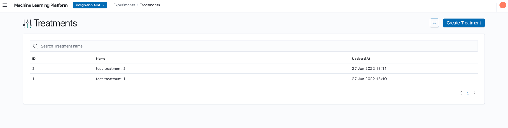
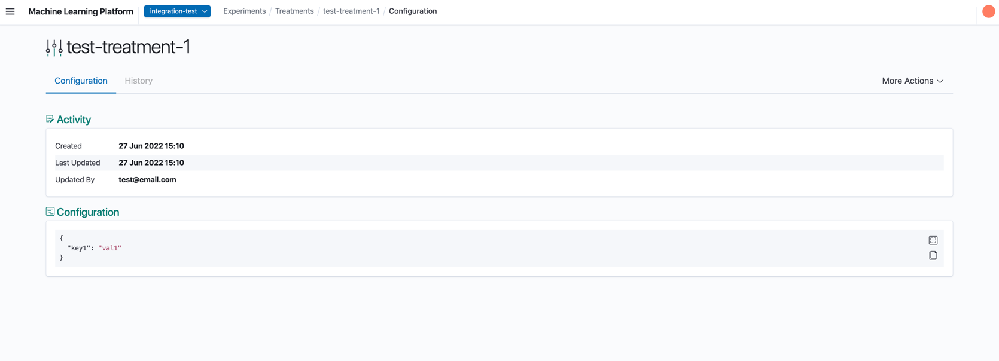
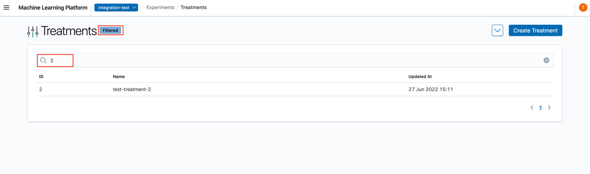
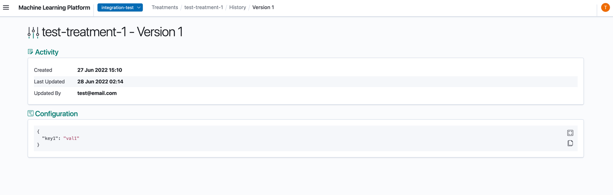

# Viewing Treatments

Once the treatment has been created, you will be able to view the treatment's configuration on the landing page.

## Navigate to Treatment Details

1. Click on the row that contains the treatment.
2. You will now be able to see the Treatment Details View.

At the top row, you will be able to see your treatment name.

### Configuration

The Configuration tab displays the selected treatment's details. These values are configured from creating or editing a treatment. The treatment can be deleted from this page as well, which will also remove all of its historical versions.

1. Configuration: General settings of the treatment.
2. Activity: Activity details of treatment.

### Searching

The UI supports searching by treatment name.

In the search panel, enter the treatment name to filter by.

### History

When a treatment is modified (edited / activated / deactivated) its existing configurations are saved as a historical version. All versions can be viewed from the **History** tab of the Treatment Details view.

The versions are ordered in the descending order of creation (the most recent version appearing on top). The Created and Updated dates of the version symbolize the duration that the configuration was applied in the treatment. Selecting a row opens the details of the version.

