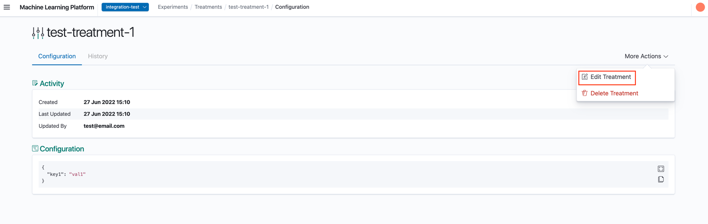
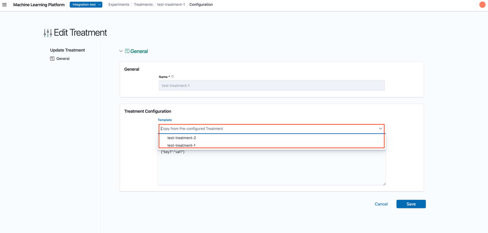

# Modifying Treatments

1. In the Treatment Details Page, click 'Edit Treatment'

2. In the Edit Treatment Page, you can edit the treatment's configuration. All fields except **Name** are allowed to be modified. Similar to creating a new Treatment template, you may choose to select an existing one and pre-fill some fields first rather than starting from scratch.

## Treatment History

When a treatment is edited, the existing details in the treatment prior to the edit would be saved as a historical version and can be viewed from the History tab in the Treatment Details view.

## Deleting Treatments

Treatments in XP are templates that can be deleted, deleting them prevents usage in new Experiments, but do not affect existing Experiments which were created with it.
