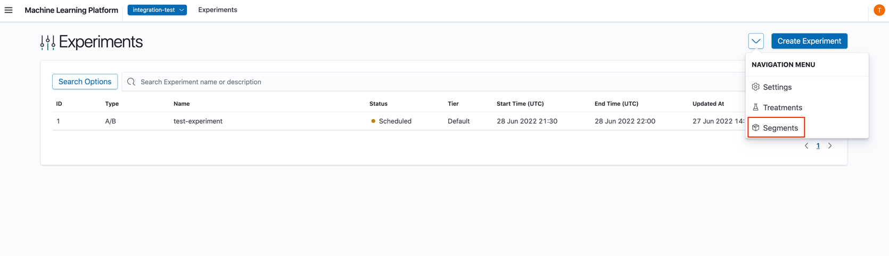
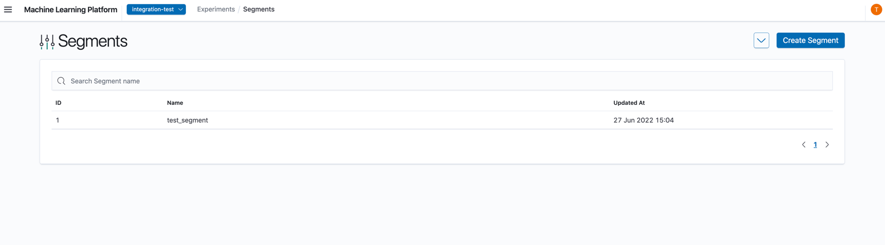
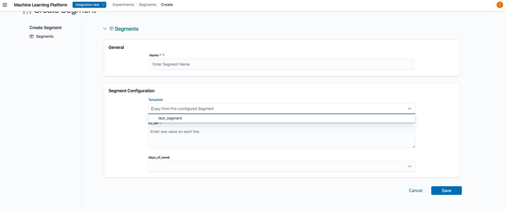

# Creating Segments

From the Experiments List page, click on 'Segments'.

Segments can be created from the segments landing page. Created segments can be used as a template, to initialise one or more segments in an experiment (See [`Creating Experiments - Configure Experiment's Segmenters`](./04_creating_experiments#2-Configure-Experiments-Segmenters) for more information).

## 0. Create Segment

a. Click on the "Create Segment" button on the landing page.

## 1. Configure Segment's General Settings

1. In the Create Segment's general settings page, you may either input the fields from scratch or choose to select a pre-configured Segment template where upon selection, would fill up the respective fields of the form. Subsequently, you may continue editing the fields if necessary.

2. __Name__: Name of Segment.
3. __Configuration__: Configuration of Segment. The dropdowns that are shown are dependent on the project's segmenters.

b. Click "Save" to create the Segment.
