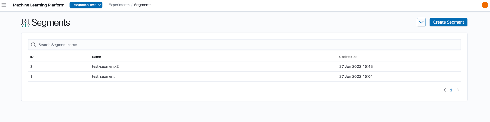
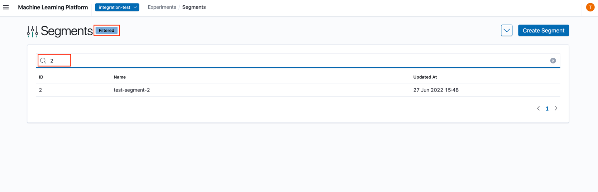
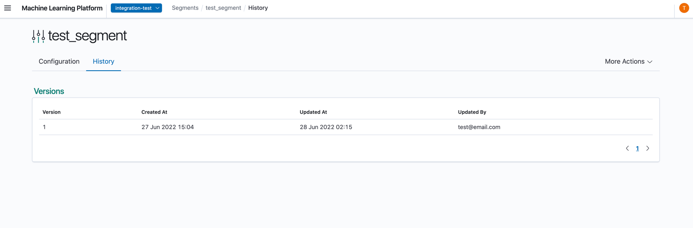
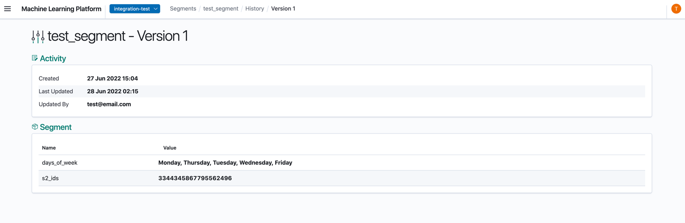

# Viewing Segments

Once the segment has been created, you will be able to view the segment's configuration on the landing page.

## Navigate to Segment Details

1. Click on the row that contains the segment.
2. You will now be able to see the Segment Details View. If one or more of the project's segmenters have been removed since an experiment has been created, the segmenter highlighted in red is no longer in use for the experiment.

At the top row, you will be able to see your segment name.

### Configuration

The Configuration tab displays the selected segment's details. These values are configured from creating or editing a segment. The segment can be deleted from this page as well, which will also remove all of its historical versions.

1. Activity: Activity details of segment.
2. Segment: Different segmenter settings of the Segment.

### Searching

The UI supports searching by segment name.

In the search panel, enter the segment name to filter by.

### History

When a segment is modified (edited / activated / deactivated) its existing configurations are saved as a historical version. All versions can be viewed from the **History** tab of the Segment Detail view.

The versions are ordered in the descending order of creation (the most recent version appearing on top). The Created and Updated dates of the version symbolize the duration that the configuration was applied in the segment. Selecting a row opens the details of the version.

