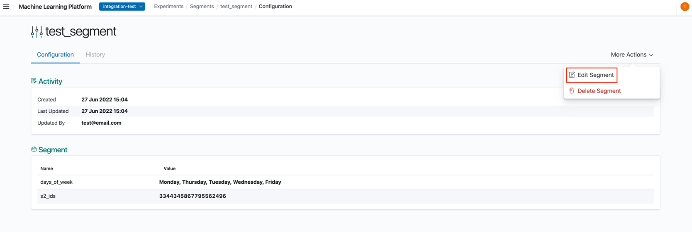
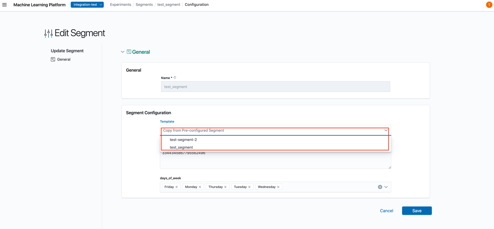

# Modifying Segments

1. In the Segment Details Page, click 'Edit Segment'.

2. In the Edit Segment Page, you can edit the segment's configuration. All fields except **Name** are allowed to be modified. Similar to creating a new Segment template, you may choose to select an existing one and pre-fill some fields first rather than starting from scratch.

## Segment History

When a segment is edited, the existing details in the segment prior to the edit would be saved as a historical version and can be viewed from the History tab in the Segment Details view.

## Deleting Segments

Segments in XP are templates that can be deleted, deleting them prevents usage in new Experiments, but do not affect existing Experiments which were created with it.
