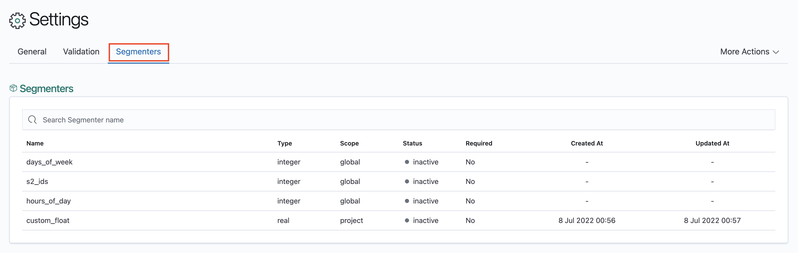
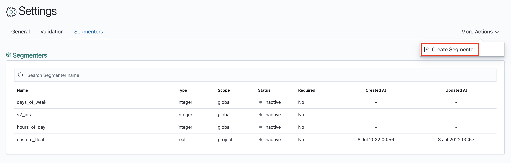
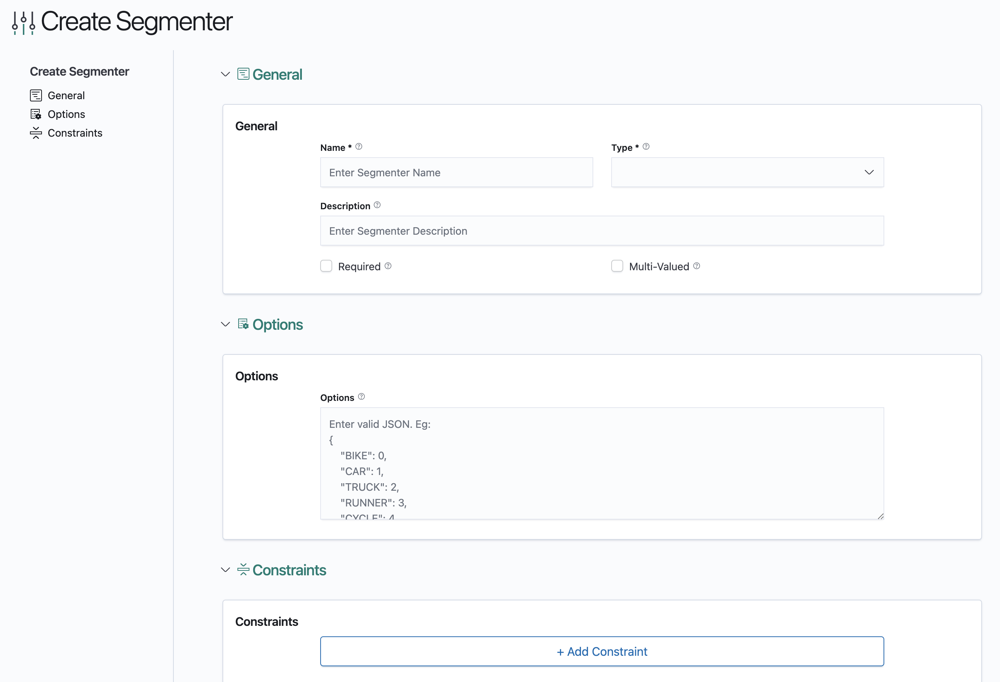

# Creating Custom Segmenters

From the Settings page, click on the 'Segmenters' tab.

Created segmenters can be used just as global segmenters, but only in the project in which they are created in.

## 0. Create Segmenter
1. Click on 'More Actions', followed by the 'Create Segmenter' button on the landing page.
   

## 1. Configure Segmenter's General Settings
1. In the Create Segmenter's general settings page, fill up the given form
   
    1. __Name__: Name of segmenter.
    2. __Type__: Type of the segmenter (string, bool, integer or real).
    3. __Description__: Description of segmenter.
    4. __Required__: Indicates whether the segmenter must be selected in experiments.
    5. __Multi-Valued__: Indicates whether the segmenter has multiple values.
    6. __Options__: Name-value pairs for the segmenter values. This field needs to be a valid JSON object.
    7. __Constraints__: Constraints for the segmenter when prerequisite conditions are met.
        1. __Pre-Requisite Segmenter Values__: An array of objects with the fields `segmenter_name` and
           `segmenter_values`. This field needs to be a valid JSON array.
            1. __Segmenter_Name__: A string indicating the name of the segmenter. Note that **none** of the objects specified should have a `segmenter_name` with the
               same name as the segmenter that you are creating.
            2. __Segmenter Values__: An array of segmenter values corresponding to the segmenter.
        2. __Allowed Values__: An array of allowed segmenter values. Note that the values specified here should form
           a subset of the values specified in 'Options' and cannot be empty. This field needs to be a valid
           JSON array.
        3. __Values Override__: New name-value mappings to overwrite the names for the values under 'Options'.
           Note that the values specified here should form a subset of the values specified in 'Options'. This field
           should specify the name-value mappings for each and every value in the allowed values field, and it needs to
           be a valid JSON object.

2. Click "Save" to create the Segmenter.
