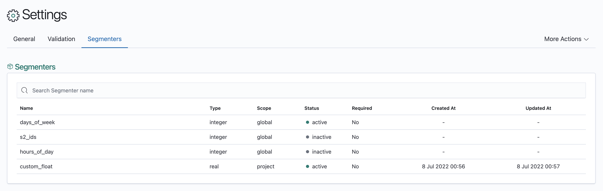

# Modifying Segmenters
1. In the Segmenter Details Page, click 'More Actions' followed by 'Edit Segmenter'.
   
2. In the Edit Segmenter Page, you can edit the segmenter's configuration. All fields except **Name** and **Type** are
   allowed to be modified.
   

# Deleting Segmenters
Custom segmenters (as opposed to global segmenters) can be deleted by clicking on the 'Delete Segmenter' button in
the 'More Actions' dropdown list.

Note that custom segmenters can only be deleted if they have been deactivated, i.e.
removed from the project settings.
