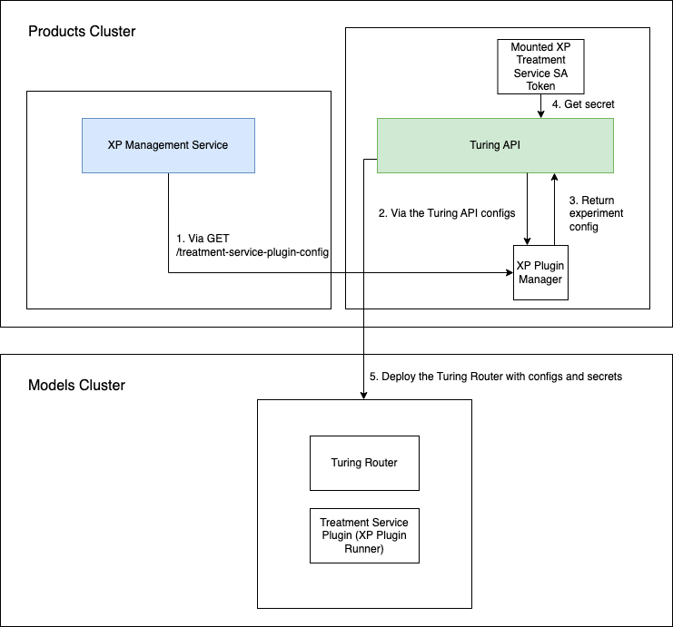

# Treatment Service Deployment

## Overview
XP's Treatment Service is currently offered in two different versions:

- a [standalone Treatment Service](#standalone-treatment-service), *it can be configured to serve treatments to multiple 
  clients/users with multiple CaraML projects*
- a [Treatment Service plugin](#treatment-service-plugin), *deployed as a 
  [Turing Router](https://github.com/caraml-dev/turing) experiment engine plugin, to serve treatments to a single 
  client/user with a single CaraML project*

## Standalone Treatment Service
The standalone Treatment Service is one that is deployed as a service and is configured to serve treatments to multiple
clients or users, with no constraint on who those clients or users are, as long as they send requests to fetch 
treatments to the Treatment Service via HTTP.

### Requirements
- [Configuration](#configuration)
- [Google Cloud Provider (GCP) service account](#google-cloud-provider-gcp-service-account)

#### Configuration
The standalone Treatment Service deployment uses configurations that can be stored in one or multiple 
configuration files (`.yaml`) files. Some examples can be found here:

- [example.yaml](https://github.com/caraml-dev/xp/blob/f5eb2bd3c3ce301f392a1120232748a9255ab998/treatment-service/config/example.yaml)
- [config1.yaml](https://github.com/caraml-dev/xp/blob/f5eb2bd3c3ce301f392a1120232748a9255ab998/treatment-service/testdata/config1.yaml)
- [config2.yaml](https://github.com/caraml-dev/xp/blob/f5eb2bd3c3ce301f392a1120232748a9255ab998/treatment-service/testdata/config2.yaml)

As shown from the various examples, there are a number of values that need to be set, though not all of them 
are necessarily required. Some of these values, when left undefined/empty, will be automatically initialised with 
certain default values (see 
[config.go](https://github.com/caraml-dev/xp/blob/f5eb2bd3c3ce301f392a1120232748a9255ab998/treatment-service/config/config.go#L22)).

#### Google Cloud Provider (GCP) Service Account
[Google Cloud Pub/Sub](https://cloud.google.com/pubsub/docs/overview) is required for the Treatment Service to 
communicate with the Management Service to retrieve information about the experiments that are being run at any point 
of time. More specifically, the Treatment Service subscribes to a Pub/Sub topic that the Management Service 
publishes to whenever there are updates to actively running experiments.

Furthermore, the Treatment Service may also interact with [Google BigQuery](https://cloud.google.com/bigquery), if 
it has been set up, to perform logging of all the treatments it assigns in a specified table.

Hence, if access control has been set up for the Pub/Sub topic or for the BigQuery table, the Treatment Service needs 
to be authenticated using a service account key that has the necessary permissions to subscribe to the aforementioned 
Pub/Sub topic or to push data to the said BigQuery table. It does so by accessing a `.json` 
[file containing the service account key](https://cloud.google.com/iam/docs/creating-managing-service-account-keys), 
whose location is stored as a filepath in the `GOOGLE_APPLICATION_CREDENTIALS` environment variable. 

Depending on how the Treatment Service is deployed, there are a variety of ways to ensure that it has access to 
the service account key file and the environment variable. See the section below for more information.

Note that the Treatment Service does not currently support the usage of multiple GCP service accounts for 
authentication, i.e the Pub/Sub topic and the BigQuery table each requires a **different** service account for 
authentication.

In short, the service account configured would minimally need these roles/permissions:
- [roles/pubsub.subscriber](https://cloud.google.com/pubsub/docs/access-control#roles), minimally, for the topic 
  that the Management Service will publish updates to
- [roles/bigquery.dataEditor](https://cloud.google.com/bigquery/docs/access-control#bigquery.dataEditor), minimally, 
  for the table that will contain the logs (if logging to BigQuery is configured)

### Deploying the Standalone Treatment Service

#### As a Helm Release

*Follow the installation steps from https://github.com/caraml-dev/helm-charts/tree/main/charts/xp-treatment*

##### 2.1 Configure the Standalone Treatment Service to use a Google Cloud Provider (GCP) Service Account (Optional) 

In particular, should you need to use a GCP service account for authenticating, one recommended way to set this up 
is to utilise [volumes](https://kubernetes.io/docs/concepts/storage/volumes/) to mount the GCP service account key file, 
which itself should be saved within a [secret](https://kubernetes.io/docs/concepts/configuration/secret/) in the 
Kubernetes cluster, into the Treatment Service [pod](https://kubernetes.io/docs/concepts/workloads/pods/). Adding the 
environment variable `GOOGLE_APPLICATION_CREDENTIALS` with the path to the mounted key file would then allow the 
Treatment Service to access it.

When deploying the Treatment Service with Helm, however, it is convenient to specify `extraVolumes`, 
`extraVolumeMounts` and `extraEnvs` in the Helm chart values (see
[values.yaml](https://github.com/caraml-dev/xp/blob/f5eb2bd3c3ce301f392a1120232748a9255ab998/infra/charts/treatment-service/values.yaml#L59)), as they 
automatically get added to the Treatment 
Service deployment's volumes, volume mounts and environment variables respectively, via templates in the Helm chart 
(see 
[deployment.yaml](https://github.com/caraml-dev/xp/blob/f5eb2bd3c3ce301f392a1120232748a9255ab998/infra/charts/treatment-service/templates/deployment.yaml#L37)).

*Note that this is NOT the only one way to set the GCP service account key file to allow the Treatment Service to
access it. There are a wide variety of other methods, such as containerising the Treatment Service binary together with 
the GCP service account key file, but we will not be listing all of them here.*

##### 3. Update the Helm Release

To subsequently update a deployed release of `xp-treatment`, you may run the following, which updates 
not only the `xp-treatment`'s image but also its config values:

```shell
$ helm upgrade xp-treatment xp/xp-treatment \
    --set xpTreatment.image.tag=${NEW_VERSION_TAG} \
    --values=path/to/updated/helm/chart/values/file.yaml
```

### Monitoring the Treatment Service

The Treatment Service generates Prometheus metrics of two different kinds, regular Kubernetes metrics, as well as 
custom metrics unique to the Treatment Service. These metrics are all exported on the `\metrics` endpoint of the `api` 
container of the pod in which the Treatment Service is deployed.

#### Regular Kubernetes Metrics

These are regular Kubernetes metrics generated via the 
[kube-state-metrics (KSM)](https://github.com/kubernetes/kube-state-metrics) service that listens to the Kubernetes API 
server and generates metrics about the state of the pod in which the Treatment Service is deployed. These metrics are 
out-of-the-box Prometheus metrics that track 
[common statistics](https://github.com/kubernetes/kube-state-metrics/blob/main/docs/pod-metrics.md) such as CPU and 
memory usage, CPU throttling, etc. and usually begin with the `kube_` prefix.

#### Custom Metrics produced by the Treatment Service

These are custom Prometheus metrics generated by the Treatment Service that track metrics which concern the fetching of 
treatments, such as the duration for fetching a treatment, number of fetch treatment requests, etc.

| Metric Name                                                   | Description                                                            | Type      | Tags                                                                                                      | Unit         |
|---------------------------------------------------------------|------------------------------------------------------------------------|-----------|-----------------------------------------------------------------------------------------------------------|--------------|
| mlp_xp_treatment_service_fetch_treatment_request_duration_ms  | The duration for responding to a http request for fetching a treatment | Histogram | `project_name`, `experiment_name`, `treatment_name`, `response_code`                                      | Milliseconds |
| mlp_xp_treatment_service_experiment_lookup_duration_ms        | The duration for an experiment lookup to be performed                  | Histogram | `project_name`                                                                                            | Milliseconds |
| mlp_xp_treatment_service_fetch_treatment_request_count        | The number of fetch treatment requests received                        | Counter   | `project_name`, `experiment_name`, `treatment_name`, `response_code`, and additional custom metric labels | -            |
| mlp_xp_treatment_service_no_matching_experiment_request_count | The number of fetch treatment requests with no matching experiments    | Counter   | `project_name`, `response_code`, and additional custom metric labels                                      | -            |

Notice that these custom metrics have the prefix `mlp_xp_treatment_service_`.

## Treatment Service Plugin

Unlike the standalone Treatment Service, the Treatment Service Plugin only operates with 
[Turing Routers](https://github.com/caraml-dev/turing) and is only configured to serve treatments to requests from a 
single CaraML project. It is unable to serve treatments to any other client other than the Turing Router in which it 
is configured as a plugin for.

### Requirements

- [Configuration](#configuration-1)
- [Google Cloud Provider (GCP) service account](#google-cloud-provider-gcp-service-account-1)

#### Configuration

Unlike for the standalone Treatment Service whereby the configuration values are placed in a file solely dedicated for Treatment Service configurations, the Treatment Service Plugin configuration values need to be placed under the experiment engines section, within the 
[Helm chart values](https://github.com/caraml-dev/helm-charts/blob/ce4026287443c9d5f2c3fb69d2dd33f3d90f89e3/charts/turing/values.yaml#L118) 
of a Turing API server deployment.

Note that not all the configuration values used in a standalone Treatment Service need to be specified for the Treatment Service Plugin, since some of those values will be retrieved directly via the Management Service (e.g. Pub/Sub  configuration or segmenter configuration). See [below](#1-prepare-the-turing-api-server-helm-chart-values-file) for 
an example of the configuration values that need to be specified.

When the Turing API server deploys a router, the plugin manager will automatically retrieve the aforementioned configurations from the Management Service, as well as the experiment engine configuration (shown in the code block above) from the Turing API server. 

The plugin manager then creates a new plugin configuration object that will subsequently be passed to the API and then to the Treatment Service plugin runner, which will be configured with those values passed to it.



#### Google Cloud Provider (GCP) Service Account

Just as in the standalone Treatment Service, a GCP Service Account with the following roles is needed for the Treatment Service Plugin to communicate with the Management Service via a
[Google Cloud Pub/Sub](https://cloud.google.com/pubsub/docs/overview) subscription and for logging 
treatment responses to a table in [Google BigQuery](https://cloud.google.com/bigquery):
- [roles/pubsub.subscriber](https://cloud.google.com/pubsub/docs/access-control#roles), minimally, for the topic that the Management Service will publish updates to
- [roles/bigquery.dataEditor](https://cloud.google.com/bigquery/docs/access-control#bigquery.dataEditor), minimally, for the table that will contain the logs (if logging to BigQuery is configured)

### Deploying the Treatment Service Plugin

This guide assumes that you are deploying the Treatment Service Plugin as part of a Turing API server deployment via 
its
[Helm chart](https://github.com/caraml-dev/turing/tree/477ac2392c590d3dd6453a5834657dc773fe0e56/infra/charts/turing).

#### 1. Specify the Treatment Service Plugin within the Turing API Server Helm Chart Values File

Specify the `xp-plugin` within the 
[Helm chart values file](https://github.com/caraml-dev/turing/blob/477ac2392c590d3dd6453a5834657dc773fe0e56/infra/charts/turing/values.yaml#L104).
These details should fall under the `turing.experimentEngines` field, where other information such as the `name`, 
`type`, and `rpcPlugin.image`, need to be specified too:

```yaml
turing:
  # ...
  experimentEngines:
    - name: xp
      type: rpc-plugin
      rpcPlugin:
        image: ghcr/caraml-dev/xp-plugin:0.10.1
      # ...
      options:
        # ...
        treatment_service_plugin_config:
          # Treatment Service configuration goes here
          new_relic_config:
          # ...
          sentry_config:
          # ...
          port:
          # ...
          management_service:
          # ...
          url:
          # ...
          deployment_config:
          # ...
          assigned_treatment_logger:
          # ...
          monitoring_config:
          # ...
          swagger_config:
            enabled: false
```

As mentioned [earlier](#configuration), the Treatment Service Plugin configuration values must also be provided. 
Place those values within the `turing.experimentEngines.*.options.treatment_service_config` field of the Turing API's
[Helm chart values file](https://github.com/caraml-dev/helm-charts/blob/ce4026287443c9d5f2c3fb69d2dd33f3d90f89e3/charts/turing/values.yaml#L118).

#### 1.1 Configure the Treatment Service Plugin to use a Google Cloud Provider (GCP) Service Account (Optional)
The service account token file has to be made accessible to the Turing API server such that it is 
available for it to be mounted within a Turing Router. The Turing API server looks for this service account token 
file via the filepath stored in the `turing.expermentEngines.*.serviceAccountKeyFilePath` field of the Turing API 
server [Helm chart values file](https://github.com/caraml-dev/helm-charts/blob/ce4026287443c9d5f2c3fb69d2dd33f3d90f89e3/charts/turing/values.yaml#L118): 

```yaml
turing:
  # ...
  experimentEngines:
  - name: xp
    type: rpc-plugin
    # ...
    serviceAccountKeyFilePath: /etc/plugins/xp/gcp_service_account/service-account.json
```

How this service account token file has to be made accessible to the Turing API server deployment is up to the operator 
deploying the Turing API server and is out of scope of this guide. 

However, one recommended way to do so is to use the 
[Helm chart installation of Turing](https://github.com/caraml-dev/helm-charts/blob/ce4026287443c9d5f2c3fb69d2dd33f3d90f89e3/charts/turing), which allows the service account token file (assumed to already exist within the same cluster as the Turing API server deployment as a [secret](https://kubernetes.io/docs/concepts/configuration/secret/)) to be mounted as a volume into the Turing API server container, through the use of `extraVolumes` and `extraVolumeMounts` in the Turing API's [Helm chart values file](https://github.com/caraml-dev/helm-charts/blob/ce4026287443c9d5f2c3fb69d2dd33f3d90f89e3/charts/turing/values.yaml#L118):

```yaml
turing:
  # ...
  extraVolumes:
  # ...
  - name: xp-plugin-service-account
    secret:
      # Assume secret "xp-treatment-secret" with key "service-account.json" containing
      # GCP service account already exists in the Kubernetes cluster
      secretName: xp-treatment-secret
      items:
        - key: service-account.json
          path: service-account.json

  extraVolumeMounts:
    # ...
    - name: xp-plugin-service-account
      mountPath: "/etc/plugins/xp/gcp_service_account"
      readOnly: true
```

Specify the volume mount and service account key file paths correctly to ensure that the Turing API server is able 
to access the mounted service account token. 

Last but not least, specify the 
`turing.experimentEngines.*.options.treatment_service_config.deployment_config.google_application_credentials_env_var` 
field as follows to allow the Treatment Service Plugin to retrieve the filepath of the GCP service account secret token from the Turing Router container correctly (the Turing API automatically injects the filepath of the mounted service account token as the `GOOGLE_APPLICATION_CREDENTIALS_EXPERIMENT_ENGINE` env var within the Turing Router):

```yaml
turing:
  # ...
  experimentEngines:
    - name: xp
      type: rpc-plugin
      rpcPlugin:
        image: ghcr/caraml-dev/xp-plugin:0.10.1
      # ...
      options:
        # ...
        treatment_service_plugin_config:
          # ...
          deployment_config:
            # ...
            google_application_credentials_env_var: GOOGLE_APPLICATION_CREDENTIALS_EXPERIMENT_ENGINE
```

#### 2. Deploy the Turing API Server

Deploy the Turing API server as usual and deploy Turing Routers with it to observe any changes made.

### Monitoring the Treatment Service

Unlike the standalone Treatment Service, the Treatment Service Plugin does not generate its own Kubernetes metrics, 
since it is running as a child process of a Turing Router. It does however, generate the 
[same custom Prometheus metrics](#custom-metrics-produced-by-the-treatment-service) as that 
of the standalone Treatment Service:

| Metric Name                                     | Description                                                            | Type      | Tags                                                                                                      | Unit         |
|-------------------------------------------------|------------------------------------------------------------------------|-----------|-----------------------------------------------------------------------------------------------------------|--------------|
| mlp_turing_fetch_treatment_request_duration_ms  | The duration for responding to a http request for fetching a treatment | Histogram | `project_name`, `experiment_name`, `treatment_name`, `response_code`                                      | Milliseconds |
| mlp_turing_experiment_lookup_duration_ms        | The duration for an experiment lookup to be performed                  | Histogram | `project_name`                                                                                            | Milliseconds |
| mlp_turing_fetch_treatment_request_count        | The number of fetch treatment requests received                        | Counter   | `project_name`, `experiment_name`, `treatment_name`, `response_code`, and additional custom metric labels | -            |
| mlp_turing_no_matching_experiment_request_count | The number of fetch treatment requests with no matching experiments    | Counter   | `project_name`, `response_code`, and additional custom metric labels                                      | -            |

Notice though, that the metric names are slightly different - they have the `mlp_turing_` prefix instead of the 
`mlp_xp_treatment_service_` prefix of the metrics that the standalone Treatment Service generates. This is expected 
since the Treatment Service Plugin uses the Prometheus Collector of the Turing Router to export its metrics. 
Naturally, this means that these metrics are accessible via the `\metrics` endpoint of the Turing router container 
in which the plugin is being run.

### Extra Resource Consumption Considerations

Given that the Treatment Service Plugin runs as a child process within the Turing Router container, additional CPU 
and memory consumption has to be taken into account when deploying a Turing Router. One might notice that CPU and 
memory requests/limits need to be increased for a Turing Router that was originally running with the original XP 
plugin, which was a slim interface between the Turing Router and a standalone Treatment Service.

Although there are no hard and fast rules for determining the extra resources needed and how much the CPU and memory 
requests/limits need to be increased, there are some simple heuristics that would allow one to foresee if extra 
resources need to be provisioned.

#### CPU

There is no strong correlation between the types or number of running experiments with the amount of extra CPU 
consumed. However, one important indicator to note is the CPU throttling percentage (%) of the Turing Router. Should 
CPU throttling be persistent, it is expected that the performance of the Treatment Service plugin will drop. 
Increasing CPU requests/limits in this case would ensure more CPU resources can be consumed to restore the original 
performance.

#### Memory

One crucial determining factor in influencing extra memory consumption is the number of running experiments that 
exist in the CaraML project of the Turing Router i.e. a Turing Router of a project with more running experiments will 
probably require more memory resources to run the Treatment Service plugin than a Turing Router 
from a project with fewer running experiments.

Furthermore, experiments that contain more details about the segments that they are running on, e.g. S2ID values, 
naturally cause the Turing Router to use more memory than one with experiments that have relatively simple segment 
definitions e.g. experiments each with 1000 S2IDs defined in their segment vs experiments with no values defined in 
their segments.
